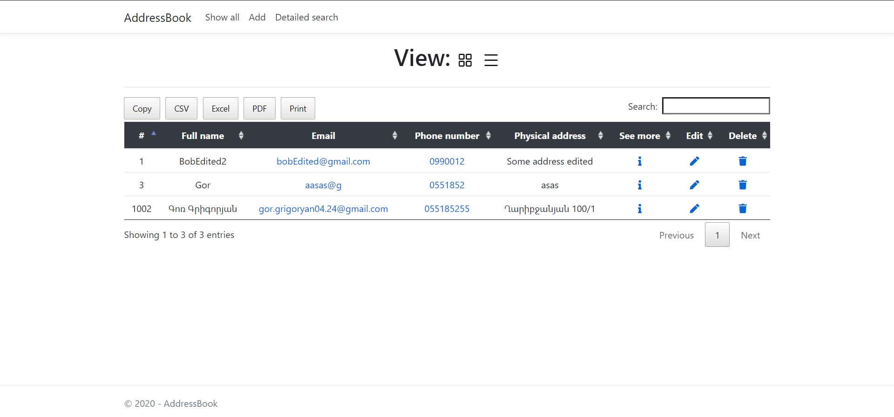

# About application

This web application act as an ```address book.```

## Functionalities

 - Show all addresses
	 - With table
	 - With cards
 - Detailed search
 - View single address with his QR code
 - Add new address
 - Edit address
 - Delete

## Dowload
Database files are located in folder [Database](https://github.com/gor8808/AddressBook/tree/master/Database) 
You can downlod [backup file](https://github.com/gor8808/AddressBook/tree/master/Database/BackupFile) OR [SQL Queries](https://github.com/gor8808/AddressBook/tree/master/Database/Queries)

## Images



## Prototypes
- [UX prototype](https://www.figma.com/file/Spp7Izo3N3xhnhITjHDHkA/AddressBook?node-id=0:1) 
- [Database prototype](https://drawsql.app/my-doc/diagrams/addressbook)
